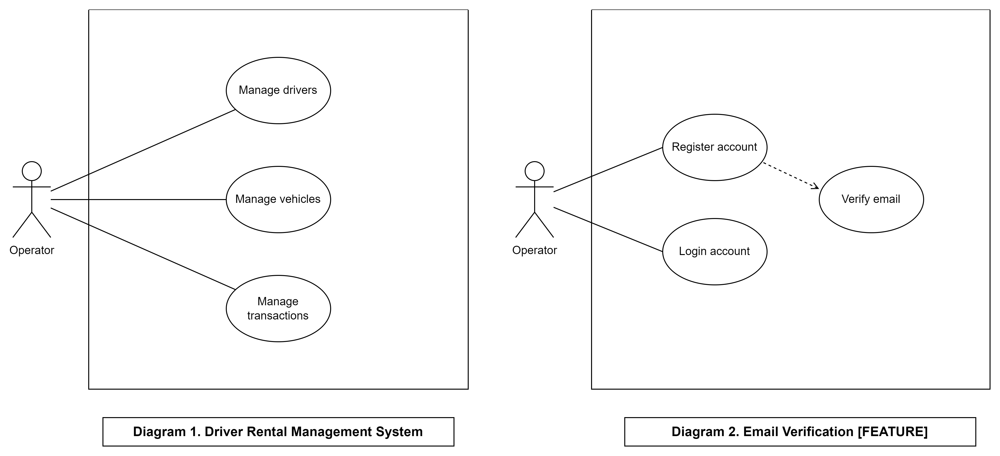
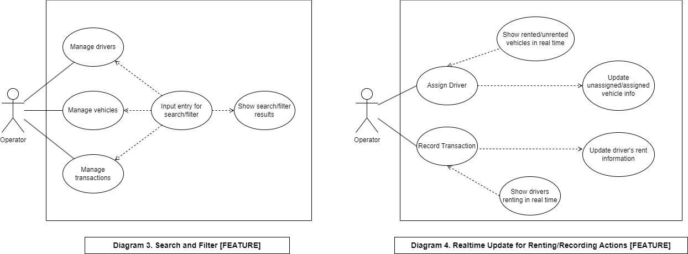
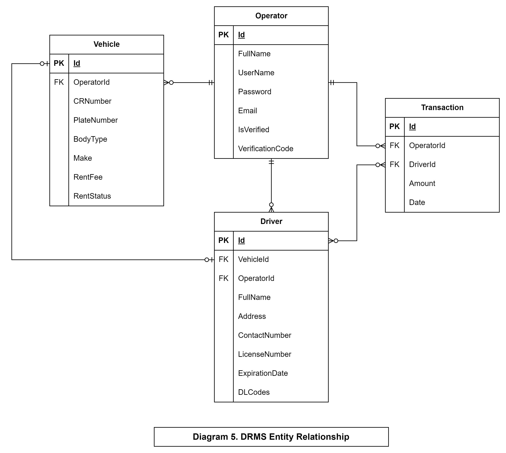
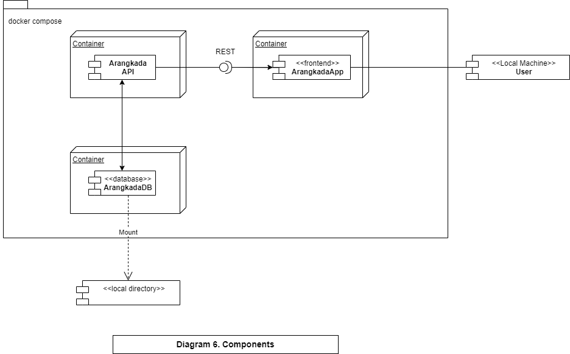

# **CSIT341 Final Project - Group 3 - Team Yamyam**
`
### Arangkada

Straightforward and easy-to-use, it allows vehicle operators to easily navigate through a no-nonsense driver rental management system.

Arangkada is a vehicle rental management system that allows operators to manage their vehicles, the drivers of these vehicles, and payment transactions.

Handle the information of all your vehicles, add and remove drivers, and keep track of driver's transactions - you can do all of these in Arangkada because we got you moving.

#### **Use Cases**

#### **Entity Relationships**

**Components**

##### Repository Source:
[CSIT341 Final Project - Arangkada](https://github.com/CITUCCS/csit341-final-project-group-3-team-yamyam)

##### SpringBoot Framework Source:
[TeamInnovators-Arangkada](TeamInnovators-Arangkada)
